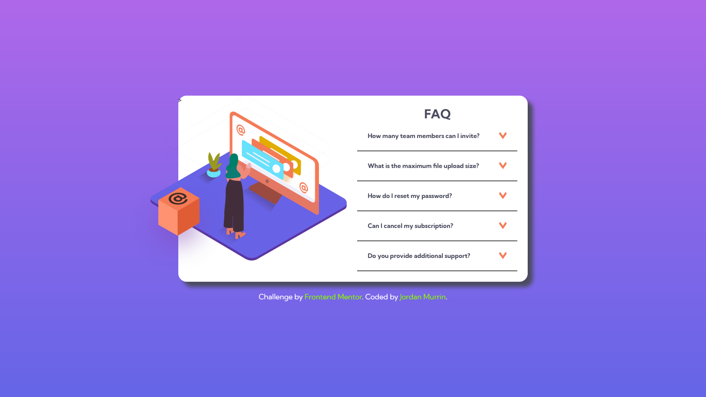

# Frontend Mentor - FAQ accordion card solution

This is a solution to the [FAQ accordion card challenge on Frontend Mentor](https://www.frontendmentor.io/challenges/faq-accordion-card-XlyjD0Oam). Frontend Mentor challenges help you improve your coding skills by building realistic projects.

## Table of contents

- [Overview](#overview)
  - [The challenge](#the-challenge)
  - [Screenshot](#screenshot)
  - [Links](#links)
- [My process](#my-process)
  - [Built with](#built-with)
  - [What I learned](#what-i-learned)
  - [Continued development](#continued-development)
  - [Useful resources](#useful-resources)
- [Author](#author)
- [Acknowledgments](#acknowledgments)

**Note: Delete this note and update the table of contents based on what sections you keep.**

## Overview

### The challenge

Users should be able to:

- View the optimal layout for the component depending on their device's screen size
- See hover states for all interactive elements on the page
- Hide/Show the answer to a question when the question is clicked

### Screenshot



### Links

- Solution URL: [Add solution URL here](https://your-solution-url.com)
- Live Site URL: [Add live site URL here](https://glittering-pegasus-78dfc3.netlify.app/)

## My process

### Built with

- Semantic HTML5 markup
- CSS custom properties
- Flexbox
- Mobile-first workflow
- Sass / scss

### What I learned

When I first looked at the challenge, what stood out was the bonus points for CSS only solution. I didn't even know that was a thing, but a Google search revealed a few pages on the topic. That's when I learned about the <details> tag.

I actually built this out twice: once using input:radio button, and once with details. Then I uploaded to Frontend Mentor and got whacked by the validators. Curses! Foiled again.

This then is my third go at it, adding semantics and losing <div> tags inside the summary (which, apparently, is not allowed).

```html
<details>
  <summary>
    <span>How many team members can I invite?</span>
    
  </summary>
  <p>
    You can invite up to 2 additional users on the Free plan. There is no limit
    on team members for the Premium plan.
  </p>
</details>
```

```css
/* to display correctly in iphone */
summary::-webkit-details-marker {
  display: none;
}
```

### Useful resources

- [Resource 1](https://codedragontech.com/createwithcodedragon/how-to-style-html-details-and-summary-tags/) - This helped me understand the details element.
- [Resource 2](https://justmarkup.com/articles/2020-09-22-styling-and-animation-details) - This is an amazing article which helped me finally get the details to work on an iPhone.

## Author

- Frontend Mentor - [@beowulf1958](https://www.frontendmentor.io/profile/beowulf1958)
